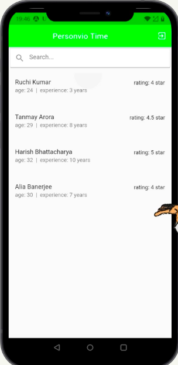
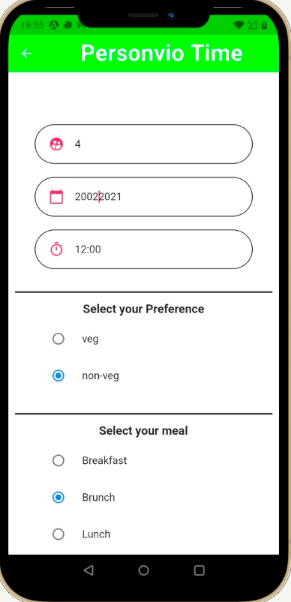
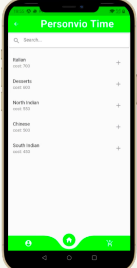
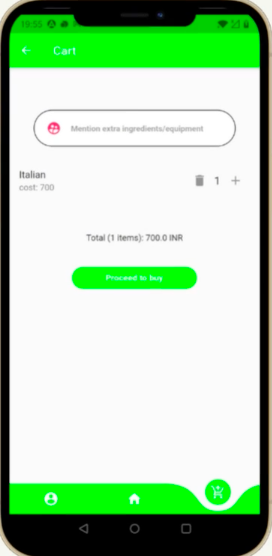
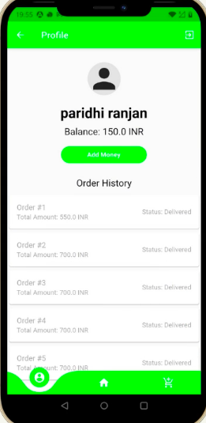
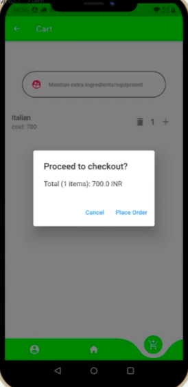
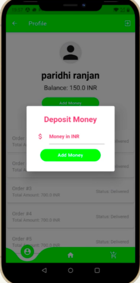
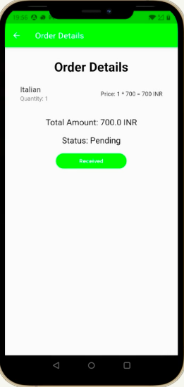

# Personvio-time
Personvio Time is a Food ordering App made with Flutter. This food ordering app is unique as it promoter customer interaction with Chef instead of restaurants. 
As Food quality and taste depend on the chef and his expertise, this app provides a list of chefs with their bio's before we place our order. An inbuilt wallet is 
integrated made with the help of razorpay and cloud firebase is used to store all the user and chef data.

## Video

Video link :- https://youtu.be/sO5H9k1DfNU
Working Demo :- https://youtu.be/qCym86GsnRQ

## Screenshots

<b>Signup & Login </b>

<b>List of Chefs</b>

 

<b>Customer form</b>

 

<b>Menu, Cart & order</b>

 
 
 
 

 
 
<b>Wallet</b>

 
 
 

